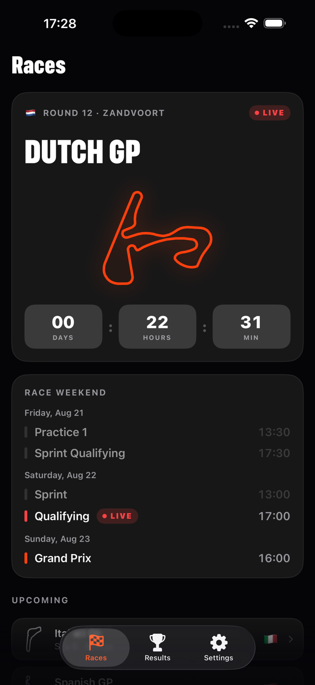
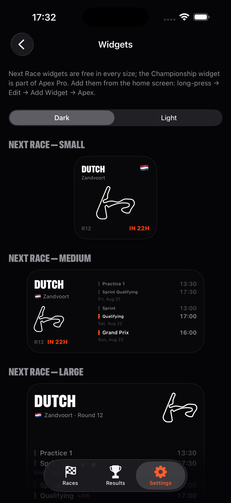
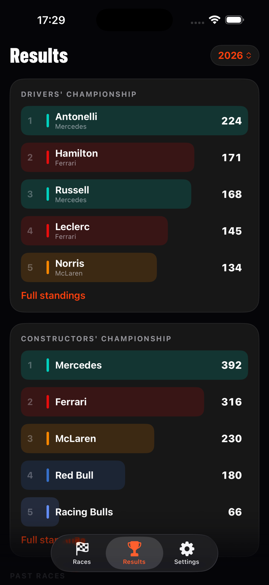

# Vasil Krumov

**Senior Software Engineer & People Lead · Plovdiv, Bulgaria**

I build web and mobile products with React, Next.js, TypeScript and NestJS, and lead and mentor engineering teams. Along the way I have moved monoliths to micro frontends and legacy React applications onto a modern Next.js stack. On the side I make my own things: Apex, an unofficial Formula 1 companion for iPhone on the App Store, and Sprout & Cauldron, a cozy potion-brewing game for Steam.

## Now · September 2026

- **Building** [Sprout & Cauldron](#sprout--cauldron), a potion-brewing game for Steam (Godot 4.7, GDScript)
- **Maintaining** [Apex for iPhone](#apex-for-iphone): v1.1 went out in September with 10 more App Store languages

## Shipped

### Apex for iPhone

An unofficial Formula 1 companion, on the App Store as *Apex: Formula Race Widgets* since August 2026. Home screen and lock screen widgets, every race weekend in your local time, a countdown to lights out, the starting grid minutes after qualifying, results, championship standings and session alerts. Free, with an optional Pro tier. No account, no tracking, no ads. An Android version is on the way.

  
  
  

- Swift and SwiftUI, iOS 17+, no third-party dependencies
- WidgetKit (home screen and lock screen families), StoreKit 2, local notifications, background refresh
- XcodeGen project and a local Swift package for the API clients, cache and shared widget views
- Built on open data: [Jolpica-F1](https://github.com/jolpica/jolpica-f1), [OpenF1](https://openf1.org) and [community circuit outlines](https://github.com/bacinger/f1-circuits)
- Source is private; the [support and privacy pages](https://vasilkrumov.github.io/) are served from [vasilkrumov.github.io](https://github.com/VasilKrumov/VasilKrumov.github.io)

Apex is an independent, unofficial app and is not associated in any way with the Formula 1 companies. F1, FORMULA ONE, FORMULA 1 and GRAND PRIX are trade marks of Formula One Licensing B.V.

## In progress

### Sprout & Cauldron

A short, cozy incremental game for Steam, played one in-game day at a time. Each morning you pick the day's herbs in the garden. Then you open the shop, brew potions at the hearth for the customers at the counter, sell or barter them and spend the silver and gold on the upgrade board before the next day. Every action is a small skill check, and none of them is a race.

- Godot 4.7, statically typed GDScript, 2D; exports for Windows, macOS and Linux
- The game logic is a pure simulation with no scene nodes, so a headless balance bot plays 120 in-game days in seconds and a reloaded day replays exactly
- Data-driven content: plants, potions, customers, achievements and a 59-node upgrade board generated from a CSV; a translation pipeline for 12 languages that rejects machine translation (English only so far); no AI-generated art, audio or translations
- Source is private; Steam page coming

## Stack

| Area | Tools |
|---|---|
| **Web** |  Next.js · React · TypeScript · Node.js · NestJS · Tailwind CSS · GraphQL and Apollo · accessibility (WCAG) |
| **Native** |  Swift · SwiftUI · WidgetKit · StoreKit 2 · Kotlin · Jetpack Compose · React Native |
| **Games** |  Godot 4 · GDScript |
| **Cloud and tooling** |  AWS (Lambda, DynamoDB, Cognito, CDK) · Azure Fundamentals ([certified](https://learn.microsoft.com/en-us/users/vasilkrumov-1337/credentials/1ec70afa82567344)) · Docker · Vercel · GitHub Actions · Vitest · Jest · Playwright · Figma |

## Contact

[LinkedIn](https://www.linkedin.com/in/vasil-krumov-li/) is the best place to reach me. I'm also on [X](https://x.com/VasilKrumov).
